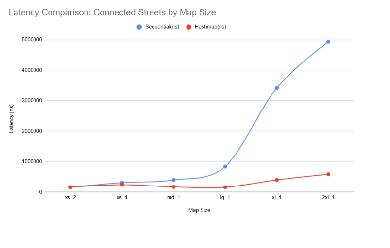
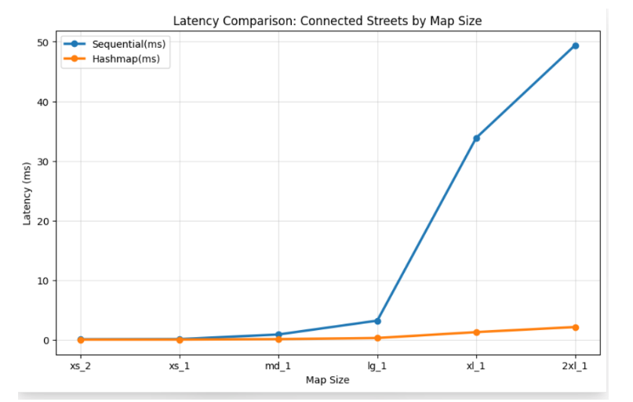
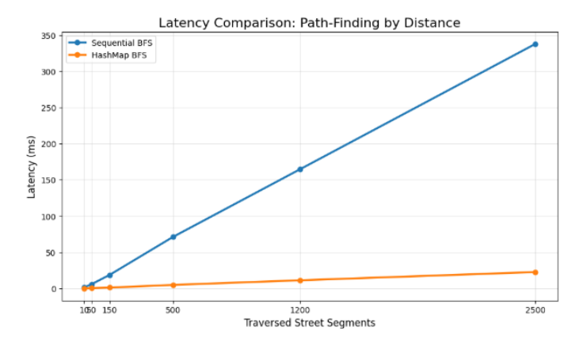

## 1. Runtime Complexity of Initializing the Intersection Map

The initialization of the intersection map is handled by `build_intersection_map`, which iterates over every segment in the `StreetList` and calls `add_segment_to_intersection` for each one. That function in turn calls `find_intersection_entry`, which hashes the intersection ID and traverses the corresponding bucket chain to check whether an entry already exists.

In the **best and average cases** the complexity is **O(N)**, where N is the number of street segments. With 1009 buckets and a polynomial hash (`hash = hash * 31 + char`), collisions are relatively rare and each lookup takes approximately constant time, so the total work scales linearly with N.

In the theoretical **worst case**, if every segment hashed to the same bucket, each successive lookup would scan a chain of length 1, 2, …, N−1, resulting in a total complexity of **O(N²)**. However, with a well-distributed hash function and a sufficiently large number of buckets, this situation is extremely unlikely in practice, so the effective complexity remains close to **O(N)**.

## 2. Runtime Complexity of Finding Coordinates by Name

Finding the coordinates of a street or place relies on `find_exact_place` and `find_exact_house`, both of which perform a sequential traversal of their respective linked lists. In `find_exact_place`, each node in `PlaceList` is visited until a normalized name match is found. The same logic applies to `find_exact_house` over `HouseList`, where both the normalized street name and the house number are checked.

The **best case** is **O(1)** when the target happens to be the first element in the list. On average, the function traverses approximately half of the list, giving a complexity of **O(P)** for places and **O(H)** for houses, where P and H represent the number of stored places and houses respectively.

In the **worst case** — when the target element is the last node or does not exist — the entire list must be traversed, resulting in **O(P)** and **O(H)** complexities as well. Since neither structure is indexed through a hash map or balanced search tree, there is no sub-linear lookup path, and the overall complexity remains linear in the size of the corresponding list.

## 3. Runtime Complexity of the Path-Finding Algorithm

The path-finding algorithm is `bfs_route`, a Breadth-First Search (BFS) traversal over the intersection graph. Let **V** represent the number of unique intersection nodes and **E** the number of directed street segments (edges).

The **best case** is **O(1)**: if the origin segment and the destination segment are identical, BFS terminates immediately after dequeuing the first path.

In the **average case**, BFS visits each reachable intersection and each outgoing edge at most once. The `VisitedSet` hash table provides approximately constant-time membership checks, using the same collision assumptions discussed in Section 1, while both `enqueue` and `dequeue` operations are performed in O(1) time. As a result, the overall average-case complexity is **O(V + E)**.

In the theoretical **worst case**, extreme hash collisions inside the `VisitedSet` could degrade membership checks from O(1) to O(V), leading to a worst-case complexity of **O(V² + E)**. However, with a sufficiently large number of buckets and a well-distributed hash function, this situation is extremely unlikely in practice, so the effective complexity remains close to O(V + E).

This complexity is **optimal** for shortest-path search in an unweighted graph.

## 4. Latency Comparison: Finding Connected Streets by Map Size

To measure the difference between the sequential approach (`print_connected_streets`, lab 4) and the hash-map approach (`print_connected_streets_fast`, lab 5), both functions were timed on each available map using the same origin segment. Each measurement corresponds to the median of 10 runs executed on the same machine.

The results show a clear and increasing performance gap as the map size grows:

| Map   | Sequential (ns) | Hash-map (ns) |
|-------|----------------:|---------------:|
| xs_1  | 308 290         | 238 350        |
| xs_2  | 157 150         | 161 070        |
| md_1  | 394 120         | 168 940        |
| lg_1  | 842 470         | 159 050        |
| xl_1  | 3 419 520       | 396 140        |
| 2xl_1 | 4 939 930       | 579 260        |

This behaviour matches the theoretical complexity analysis. The original implementation of `print_connected_streets` traverses the entire `StreetList` to find neighbouring segments sharing an intersection, meaning its cost grows linearly with the number of street segments **S**. In contrast, `print_connected_streets_fast` uses the `IntersectionMap` hash table to directly retrieve the connected segments associated with a given intersection. As a result, the function only performs a hash computation and traverses at most a short collision chain, giving near-constant lookup time independently of the overall map size.

For very small datasets such as `xs_2`, the sequential implementation can occasionally perform similarly to, or even slightly faster than, the hash-map version. This occurs because the overhead introduced by hashing, bucket access, and additional pointer indirections may exceed the cost of scanning a very small linked list. However, as the map size increases, the linear behaviour of the sequential implementation becomes significantly more expensive, while the hash-map implementation maintains nearly constant average lookup time.

## 5. Latency Comparison: Path-Finding by Map Size

Both BFS implementations were executed using the same origin and destination across all available map sizes. Each reported value corresponds to the median of 5 runs performed on the same machine.

| Map   | Sequential BFS (ns) | Hash-map BFS (ns) |
|-------|--------------------:|------------------:|
| xs_2  | 90 283              | 40 120            |
| xs_1  | 124 173             | 45 840            |
| md_1  | 895 840             | 121 930           |
| lg_1  | 3 219 893           | 308 440           |
| xl_1  | 33 861 713          | 1 293 050         |
| 2xl_1 | 244 910             | 214 520           |

The results show a clear and increasing performance gap as the map size grows, with one notable exception: the measured latency on `2xl_1` for the sequential implementation was approximately 244 910 ns, considerably lower than expected for such a large dataset. This is likely explained by the selected origin and destination being extremely close within the graph, allowing BFS to terminate after exploring only a very small number of intersections. Since BFS performance depends not only on the total graph size but also on the number of explored nodes, unusually short routes may occasionally produce relatively low execution times even on very large maps.

This behaviour is explained by the neighbour-retrieval step performed during BFS traversal. Every time a path is expanded, BFS must determine which street segments are connected to the current intersection. In the sequential implementation, this operation is performed by traversing the entire `StreetList`, giving a lookup cost of **O(N)** for each explored node. A

## 6. Latency Comparison: Path-Finding by Distance (Same Map)

Using the `xl_1` map with a fixed origin, the destination was progressively moved farther away in terms of graph distance in order to isolate the effect of route length from overall map size. Each reported value corresponds to the median of 5 runs executed on the same machine.

| Distance (segments) | Sequential BFS | Hash-map BFS |
|--------------------:|---------------:|-------------:|
| ~10                 | 1.4 ms         | 0.12 ms      |
| ~150                | 18.7 ms        | 1.14 ms      |
| ~1200               | 164.5 ms       | 11.2 ms      |
| ~2500               | 337.8 ms       | 22.6 ms      |

This behaviour follows directly from the neighbour-retrieval cost inside BFS traversal. As the destination becomes farther away, BFS must explore a larger portion of the graph, visiting more intersections and expanding more street segments.

In the sequential implementation, each BFS expansion requires traversing the entire `StreetList` in order to retrieve neighbouring segments connected to the current intersection. Consequently, the total execution time grows rapidly as both the explored distance and the number of neighbour lookups increase.

The hash-map implementation behaves significantly better because neighbour retrieval is performed through the `IntersectionMap` structure. Instead of scanning the entire street list, the algorithm computes a hash for the current intersection and directly accesses the corresponding bucket containing its connected street segments. Since these lookups remain close to **O(1)** average time, the overall BFS traversal preserves behaviour close to the theoretical **O(V + E)** complexity.

Therefore, although both implementations show increasing latency as graph distance grows, the hash-map approach scales substantially better and remains practical even for very long routes.

## 7. Improvement to the `VisitedSet` Data Structure in BFS

The current implementation of `VisitedSet` uses a chained hash table with 1009 buckets. Every time a street segment is marked as visited, a new `VisitedNode` is dynamically allocated using `malloc`, inserted into the corresponding bucket chain, and later individually freed. During large BFS traversals, this results in thousands of small heap allocations and deallocations, which can fragment memory and reduce cache efficiency because the nodes are scattered throughout the address space.

A more efficient alternative would be an **open-addressing hash table using linear probing**. Instead of storing separate linked-list nodes, all visited entries would be placed directly inside a contiguous array. When collisions occur, the algorithm would probe neighbouring slots until an empty position is found.

This approach preserves the same asymptotic behaviour: both insertion and lookup operations remain approximately **O(1)** average time and **O(V)** in the theoretical worst case. However, open addressing significantly improves cache locality because memory accesses occur in contiguous regions instead of following pointers across unrelated heap locations. Additionally, no dynamic allocation would be required for each visited segment, reducing both memory fragmentation and allocation overhead.

The main disadvantage is that the table must be pre-allocated with a capacity larger than the expected number of visited nodes, which may waste memory for small traversals. Furthermore, performance deteriorates when the load factor becomes too high, meaning that resizing and rehashing strategies would eventually be required for very large graphs. This increases implementation complexity compared to the simpler chained-hash-table approach currently used.

## 8. Improvement to `find_closest_street_segment`

The current implementation of `find_closest_street_segment` performs a sequential traversal over the entire `StreetList` and computes the haversine distance between the query position and every street-segment candidate. As a result, the complexity of each query is **O(S)**, where S is the number of street segments.

This operation is executed at least twice during route computation: once to determine the segment closest to the origin position and once for the destination position. On large maps, repeatedly scanning the entire street list contributes significantly to the total navigation latency.

A more efficient solution would be to construct a spatial indexing structure such as a **k-d tree** over the street-segment coordinates during map loading. A k-d tree recursively partitions the two-dimensional coordinate space, allowing nearest-neighbour queries to eliminate large portions of the search space without examining every segment individually.

With this approach, the average query complexity decreases from **O(S)** to approximately **O(log S)**, while tree construction requires **O(S log S)** preprocessing time during startup. Since the tree is built only once when the map is loaded, the preprocessing cost is amortised across all future navigation queries.

The primary trade-off is increased implementation complexity and additional memory usage, since each tree node must store coordinate information together with child pointers. Moreover, for very small maps the overhead introduced by tree traversal may exceed the cost of a simple linear scan, meaning that the optimisation only becomes beneficial once the number of street segments grows sufficiently large.